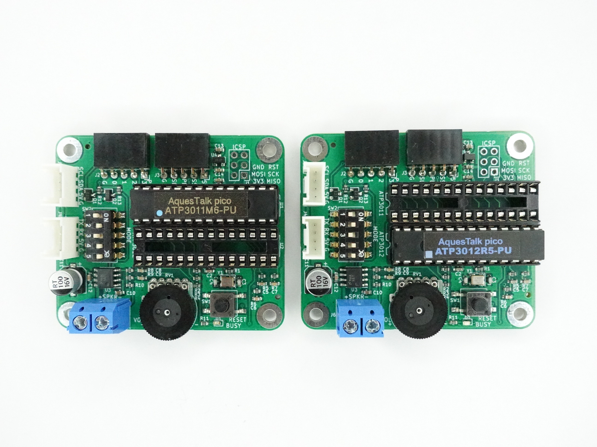
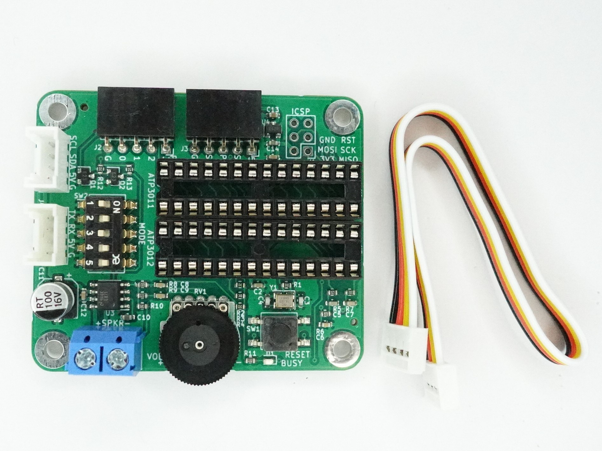
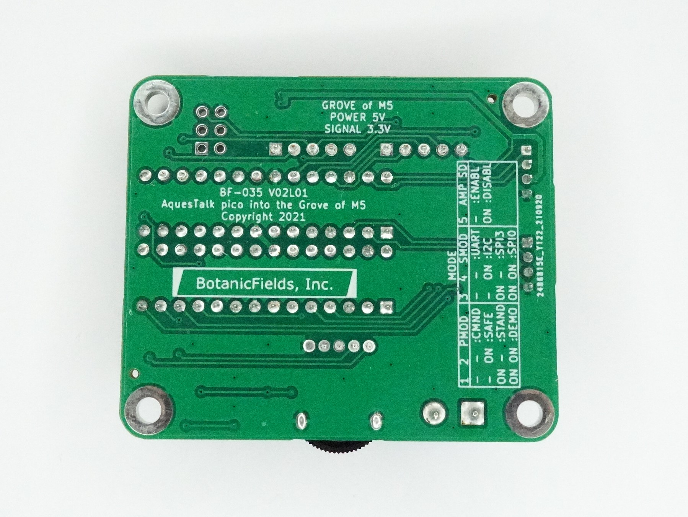
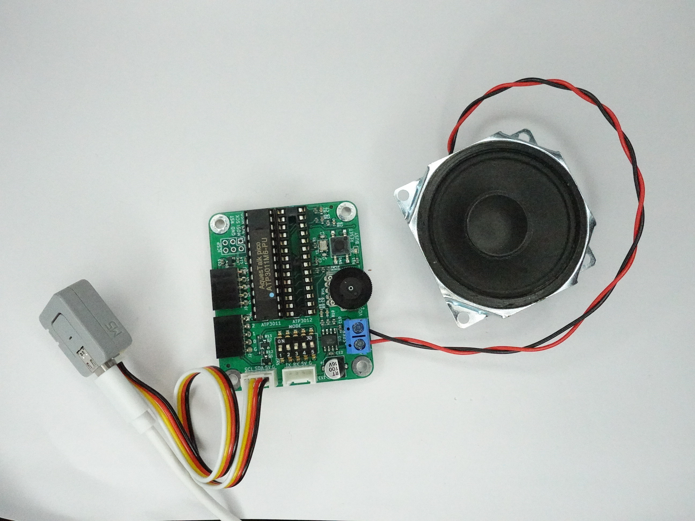
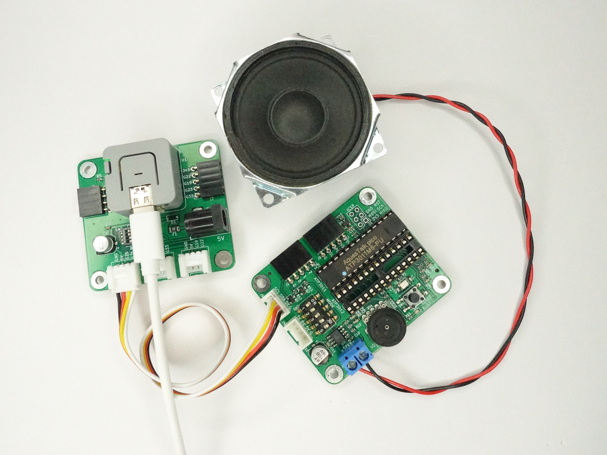
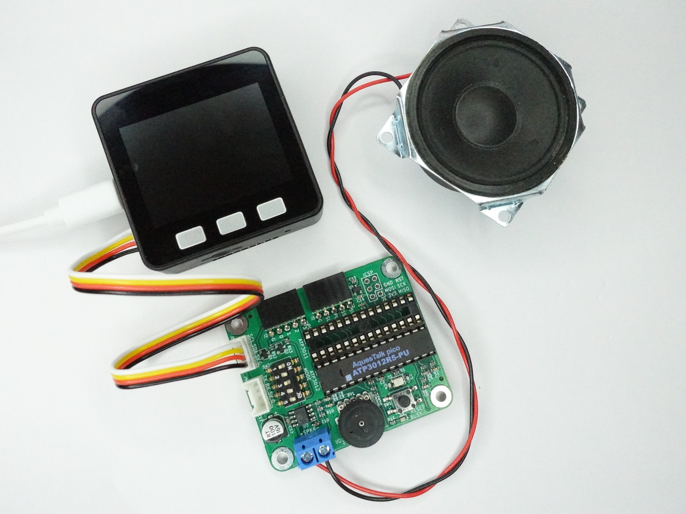
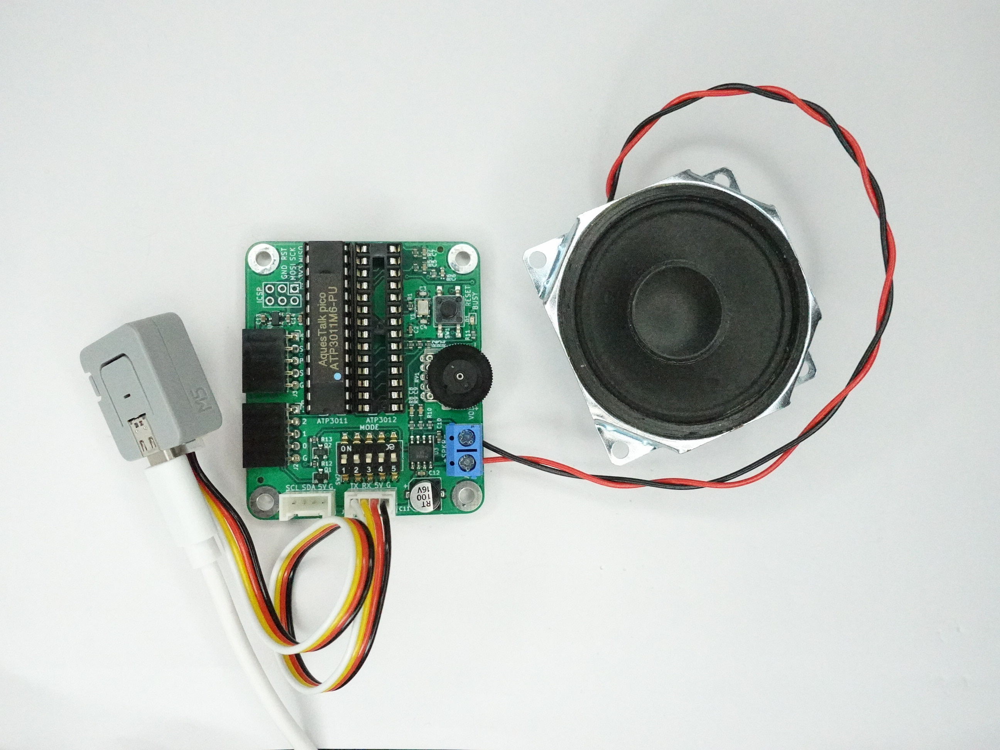
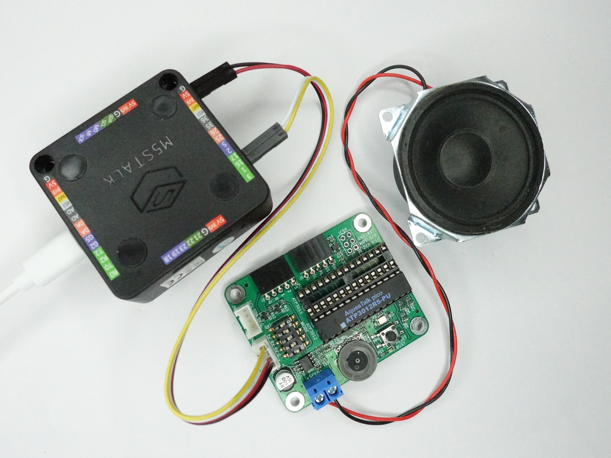
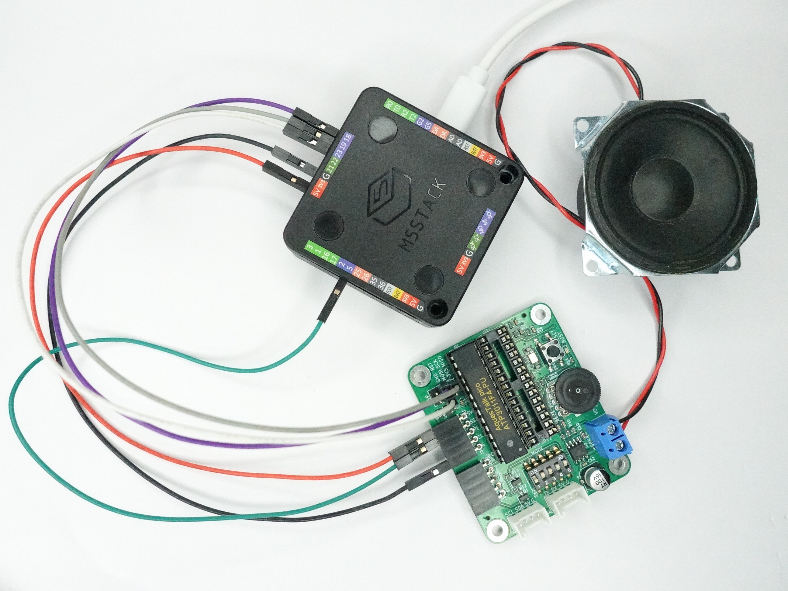
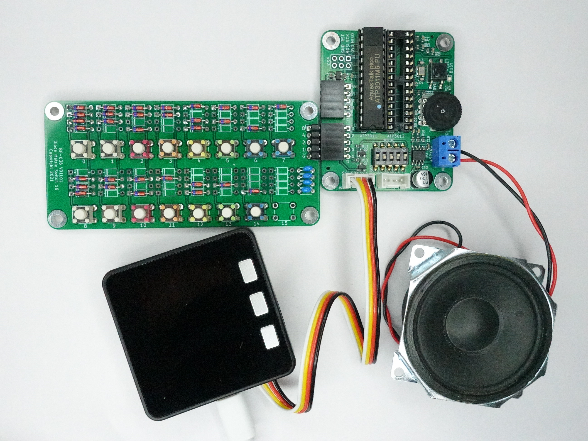

# PCB-Grove-AquesTalk-pico-LSI
# AquesTalk pico LSI用Grove(M5)接続基板
AquesTalk pico LSI into the Grove of M5

# 1. 概要
　「AquesTalk pico LSI用Grove(M5)接続基板」は、市販の音声合成専用LSI「AquesTalk pico LSI」（別売）をGroveコネクタでM5シリーズに接続するための基板です。  
　AquesTalk pico LSIの詳細は、データシートを参照ください。
- [Data Sheet: 音声合成 LSI 「AquesTalk pico LSI」ATP3011](https://www.a-quest.com/archive/manual/atp3011_datasheet.pdf)
- [Data Sheet: 音声合成 LSI 「AquesTalk pico LSI」ATP3012](https://www.a-quest.com/archive/manual/atp3012_datasheet.pdf)

### 委託販売
（スイッチサイエンス扱い）[AquesTalk pico LSI用Grove(M5)接続基板](https://www.switch-science.com/catalog/7625/)

### 動作例
（YouTube）[AquesTalk pico LSI into the Grove of M5](https://youtu.be/mju6NteZsHU)

### 組み立て例
　AquesTalk piso LSI（28ピンDIPタイプ）1個をICソケットに装着します。ATP3011用とATP3012用のソケットがあります。どちらか一方のみを装着してください。  
AquestTalk pico LSIの取り付け: 左 ATP3011, 右 ATP3012  
  

## 1.1 特徴
- AquesTalk pico LSI（28ピンDIPタイプ）1個を搭載できます。
- ATP3011, ATP3012の両方に対応しています。
- パワーアンプ（LM4871）を内蔵し、スピーカーを直接駆動できます。
- M5シリーズのGrove仕様に合わせ、電源+5V、信号3.3Vに対応します。
- AquestTalk pico LSIは3.3Vで動作し、M5シリーズに直結できます。
- DIPスイッチで動作モード・通信モードを設定できます。
- 動作モード・通信モードの変更を反映するリセットボタンがあります。
- I2C接続用、UART接続用のGroveコネクタがあり、接続方法を選べます。
- スタンドアロンモードのためのコネクタがあります。
- SPI接続も可能です（ハンダ付けが必要です）。

DIP: Dual In-line Package  
I2C: Inte-Integrated Circuit  
UART: Universal Asynchronous Receiver Transmitter  
SPI: Serial Peripheral Interface

## 1.2 内容物
- AquesTalk pico LSI用Grove(M5)接続基板（完成品）1枚  
- Groveケーブル20cm 1本（M5Stack純正品）  
- 説明書 1部  

※ AquesTalk pico LSIは付属しません。  
※ スピーカー、スピーカーケーブルは付属しません。  
※ ケースや足などは付属しません。

### 商品写真
写真左: 内容物、写真右: 基板裏面  
   

## 1.3 別途必要なもの
- AquesTalk pico LSI（秋月電子通商扱い）  
[音声合成ＬＳＩ　ＡＴＰ３０１１Ｆ１－ＰＵ（ゆっくりな女性の音声）
ATP3011F1-PU](https://akizukidenshi.com/catalog/g/gI-06220/)  
[音声合成ＬＳＩ　ＡＴＰ３０１１Ｆ４－ＰＵ（かわいい女性の音声）
ATP3011F4-PU](https://akizukidenshi.com/catalog/g/gI-05665/)  
[音声合成ＬＳＩ　ＡＴＰ３０１１Ｍ６－ＰＵ（男性の音声）
ATP3011M6-PU](https://akizukidenshi.com/catalog/g/gI-06225/)  
[音声合成ＬＳＩ　ＡＴＰ３０１２Ｆ６－ＰＵ（女性の音声明瞭版）
ATP3012F6-PU](https://akizukidenshi.com/catalog/g/gI-09973/)  
[音声合成ＬＳＩ　ＡＴＰ３０１２Ｒ５－ＰＵ（小型ロボットの音声）
ATP3012R5-PU](https://akizukidenshi.com/catalog/g/gI-11517/)  
- スピーカー  
4～8Ω程度、1W以上が望ましいです
- スピーカーケーブル  
スピーカーを基板上のターミナルブロックに接続します。
- 工具  
ドライバ（ターミナルブロックの締め付けに必要です）など
- M5Stack, M5Atom  
サンプルプログラムは、M5Stack Core Basic, M5Atomで動作を確認しています
- Arudino-IDEが動作する環境  
- その他  
SLEEP信号などを接続する場合には、ジャンパケーブルが必要です。SPI接続の場合には、ピンヘッダおよびハンダ付けが必要です

# 2. 接続

## 2.1 I2C接続
　SCL, SDAの表記のあるGroveコネクタJ5に接続します。基板上にプルアップ抵抗はありません。M5シリーズ側でのプルアップを使用します。

### (1)M5AtomのGroveコネクタに接続  
　I2Cとして、SCL=GPIO32, SDA=GPIO26を指定します。サンプルプログラムではWire1を選択します。

### (2)「M5Atom用GROVEコネクタ基板※（別売）」経由で接続  
　I2Cとして、デフォルトのWire（SCL=GPIO21, SDA=GPIO25）を使用できます。  
※（スイッチサイエンス扱い）[M5Atom用GROVEコネクタ基板](https://www.switch-science.com/catalog/7309/)

### (3)M5stackのGroveコネクタに接続  
　I2Cとして、デフォルトのWire（SCL=GPIO22, SDA=GPIO21）を使用できます。

## 2.2 UART接続
　TX, RXの表記のあるGroveコネクタJ4に接続します。基板上のTXがM5シリーズのRXに、基板上のRXがM5シリーズのTXに接続されます。

### (1)M5AtomのGroveコネクタに接続  
　M5Atom側は、RX=GPIO32, TX=GPIO26を指定します。

### (2)M5stackのGPIOに接続  
　接続には、「GROVE - 4ピン - ジャンパオスケーブル※（別売）」相当のケーブルが必要です。M5Stack側は、RX=GPIO16, TX=GPIO17, +5V, GND を接続します。  
※（スイッチサイエンス扱い）[GROVE - 4ピン - ジャンパオスケーブル](https://www.switch-science.com/catalog/6245/)

## 2.3 SPI接続
　SS, +5V, GNDは、ピンソケットJ3に接続します。SCK, MOSI, MISOは、J1(ICSP)に接続します。ICSPのピンヘッダは実装していません。ピンヘッダを別途手配いただき、基板へハンダ付けしてください。接続にはジャンパケーブル等が必要です。
- SPI: Serial Periphral Interface
- SCK: Serial ClocK
- MOSI: Master Out Slave In
- MISO: Master In Slave Out
- SS: Slave Select
- GND: Ground
- ICSP: In Circuit Serial Programming

### M5stackのGPIOに接続
　接続にはジャンパケーブル等が必要です。SCK=GPIO18, MISO=GPIO19, MOSI=GPIO23, SS=GPIO5, +5V, GND を接続します。

## 2.4 スタンドアロン
　J2に「ダイオードマトリクススイッチ16基板※」を接続し、ボタン操作で15種類の音声を再生できます。以下の写真でM5Stackは、電源として使用しています。  
※（スイッチサイエンス扱い）[ダイオードマトリクススイッチ16基板](https://www.switch-science.com/catalog/7626/)

# 3. 設定（DIPスイッチ）
　動作モードおよび使用するインタフェース（通信モード）に合わせて、基板上のDIPスイッチを設定します。おすすめはI2C接続です。DIPスイッチの設定はリセット時に反映されます。DIPスイッチの設定を変更後、基板上のリセットボタンを押す必要があります。出荷時の設定は、セーフモード・I2C接続・パワーアンプが常に動作状態（OFF,ON,OFF,ON,ON）です。

| 1 | 2 | 3 | 4 | 5 |動作モード|通信モード|備考|
|:-:|:-:|:-:|:-:|:-:|:-:|:-:|:- |
|OFF|OFF|OFF|ON | - | コマンド入力モード |I2C |I2CアドレスはEEPROMに設定した値（初期値0x2E）|
|OFF|ON |OFF|ON | - | セーフモード |I2C |I2Cアドレスは強制的に0x2E|
|OFF|OFF|OFF|OFF| - | コマンド入力モード |UART|設定されたスピードで動作 (*1) |
|OFF|ON |OFF|OFF| - | セーフモード |UART|強制的に9600bpsで動作|
|OFF| - |ON |OFF| - | - | SPI mode 3 | - |
|OFF| - |ON |ON | - | - | SPI mode 0 |サンプルプログラムはSPI mode 0で動作|
|ON |OFF| - | - | - | スタンドアロンモード | - |PC0-3の信号入力によりプリセットメッセージを選択して再生|
|ON |ON | - | - | - | デモモード | - |プリセットメッセージを順番に自動再生|
| - | - | - | - |ON | - | - |パワーアンプが常に動作状態 |
| - | - | - | - |OFF| - | - |音声再生中以外は、パワーアンプをシャットダウンする(*2)|

※ 1, 2, 3, 4, 5は、DIPスイッチの番号です。DIPスイッチはONでGND接続のため、ON=0, OFF=1です。  
(*1) ATP3011の場合、SLEEP解除後の'?'送信で自動設定します。ATP3012の場合EEPROMに設定します。  
(*2) 音声再生の前後にノイズが発生します。

### JP3 SLEEP信号
　AquesTalk pico LSIのSLEEPピンをGPIOに接続できます。SLEEP=LowでAquesTalk pico LSIがスリープ状態になります。ATP3011のUART接続において9600bpsより速い速度が必要な場合、「セーフモード」ではなく「コマンド入力モード」が必要であり、速度設定のためにSLEEPの接続が必要です。

### JP3 PLAY信号
　AquesTalk pico LSIのPLAYピンをGPIOに接続できます。AquesTalk pico LSIが音声再生中の間、PLAY=Lowとなります。

# 4. サンプルプログラム
　AquesTalk pico LSIをM5StackまたはM5Atomに接続し、I2C(Wire), UART(Serial), SPIで動作させるプログラムです。デモの内容は同じです。Arduino-IDE環境で使用します。基板の接続や設定を予め使用するインタフェースに合わせておく必要があります。

### BF-035_Wireフォルダ
　AqeusTalk pico LSIをI2Cで動作させるサンプルプログラムです。#defineでM5Stack, M5Atomのいずれかを選択します。

### BF-035_Serialフォルダ
　AqeusTalk pico LSIをUARTで動作させるサンプルプログラムです。#defineでM5Stack, M5Atomのいずれかを選択します。

### BF-035_Spiフォルダ
　AqeusTalk pico LSIを SPIで動作させるサンプルプログラムです。M5Stack専用です。

## 4.1 ボタン操作 .. loop()
　ボタンを押すと、ソースコードのpreset_msgを発声します。初期値はpreset_msg[0]です。

| M5 | ボタン | 停止中 | 発声中 |
|:-:|:-:|:-:|:-:|
|M5Stack| A   | 1つ前のpreset_msgを発声 | 発声を中断して1つ前のpreset_msgを発声 |
|M5Stack| B   | 現在のpreset_msgを発声 | 発声を中断して停止 |
|M5Stack| C   | 1つ後のpreset_msgから連続して発声 | 発声を中断して1つ後のpreset_msgから連続して発生 |
|M5Atom | Btn | 現在のpreset_msgから連続して発声 | 発声を中断して停止 |

## 4.2 setup()
- SLEEPピンをHighにする（デフォルト: 実行しない）  
　AquesTalk pico LSIのSLEEPピンとが接続したGPIO5をHIGHにしてSLEEPでない状態にします。

- UARTスピードを設定（ATP3011が対象。UARTのみ。デフォルト: 実行しない）  
　AquesTalk pico LSI (ATP3011) のUARTスピードを設定します。GPIO5がAquesTalk pico LSIのSLEEPピンと接続している必要があります。

- UARTスピードを書き換え（ATP3012が対象。UARTのみ。デフォルト: 実行しない）  
　AquesTalk pico LSI (ATP3012) のUARTスピードを書き換えます。

- I2Cアドレスを書き換え（I2Cのみ。デフォルト: 実行しない）  
　AquesTalk pico LSIのI2Cアドレスを書き換えます。

- プリセットメッセージを書き込む（デフォルト: 実行しない）  
　AquesTalk pico LSIにプリセットメッセージとして、ソースコード内のpreset_msgデータを書き込みます。時間がかかります。

- EEPROMデータをダンプ（デフォルト: 実行しない）  
　AquesTalk pico LSIのEEPROMデータをシリアルモニタに表示します。時間がかかります。

- AquesTalk pico LSIのバージョンをシリアルモニタに表示

- チャイムJを発声

- チャイムKを発声

# 5. ライブラリ
　AquesTalk pico LSIを使用するためのライブラリです。

## 5.1 BF_AquesTalkPico.h
　I2C, UART, SPI共通の基本クラスです。接続するインタフェースに依ってI2C(Wire), UART(Serial), SPIのいずれかの派生クラスを使用する必要があります。

### (1) virtual int Send(const char* msg) = 0
　AquesTalk pico LSIに文字列msgを送信します。送信の様子をシリアルモニタに出力します。純粋仮想関数として定義し、使用するインタフェースに合わせて派生クラスで実装します。

### (2) virtual size_t Recv(char* res, size_t res_size) = 0
　AquesTalk pico LSIから文字列を受信します。受信完了は、'>'または'*'で判断します。純粋仮想関数として定義し、使用するインタフェースに合わせて派生クラスで実装します。

### (3) virtual bool Busy() = 0
　発声中などAquesTalk pico LSIが処理中の場合trueを応答します。falseの場合発声が終了したと判断できます。純粋仮想関数として定義し、使用するインタフェースに合わせて派生クラスで実装します。I2C, SPIではおのずとポーリングができますが、UARTではSend()による明示的なポーリングが必要です。

### (4) int ShowRes(int res_length_to_show = 1)
　AquesTalk pico LSIからの応答をシリアルモニタに出力します。res_length_to_showに2を渡すと、応答が1文字以下の場合にシリアルモニタへの出力を抑止できます。I2C、SPIのポーリングによる応答が正常（'>', 1文字）の場合のシリアルモニタへの出力を省略できます。

### (5) int DumpEeprom()
　AquesTalk pico LSIのEEPROM (アドレス0x000-0x3FF) の値をシリアルモニタに出力します。

### (6) int WriteEeprom(int address, int data)
　AquesTalk pico LSIのEEPROMにデータを書き込みます。

### (7) int WritePresetMsg(const char* msg[], int num_of_msg)
　AquesTalk pico LSIのEEPROMにプリセットメッセージを書き込みます。書き込みの様子をシリアルモニタに出力します。

### (8)  int WriteSpeed(int speed)
　発話速度をEEPROMに設定します。50～300を設定できます。デフォルトは100です。

### (9)  int WritePause(int pause)
　文末ポーズの長さをEEPROMに設定します。256～65535を設定できます。65535を設定すると自動になります。デフォルトは65535です。

### (10) int WriteSerialSpeed(int serial_speed)
　AquesTalk pico LSI (ATP3012) のシリアル通信速度を書き換えます。デフォルトは9600です。

### (11) int WriteI2cAddress(int i2c_address)
　AquesTalk pico LSIのI2Cアドレスを書き換えます。デフォルトは0x2Eです。

## 5.2 BF_AquesTalkPicoWire.h
　AquesTalk pico LSIとI2Cでインタフェースする派生クラスです。

### int Begin(TwoWire &wire, int i2c_address = 0x2e);
　AquesTalk pico LSIを接続するI2CとI2Cアドレスを指定します。

## 5.3 BF_AquesTalkPicoSerial.h
　AquesTalk pico LSIとUARTでインタフェースする派生クラスです。

### int Begin(Stream &stream);
　AquesTalk pico LSIを接続するUARTを指定します。

## 5.4 BF_AquesTalkPicoSpi.h
　AquesTalk pico LSIとSPIでインタフェースする派生クラスです。

### int Begin(SPIClass &spi, int ss);
　AquesTalk pico LSIを接続するSPIとSSとして使用するGPIOを指定します。

# 6. 参考
Qiita: [AquesTalk pico LSI を M5Stack の I2C, UART, SPI で動かす](https://qiita.com/BotanicFields/items/fff644f408c291e5a5f0)
